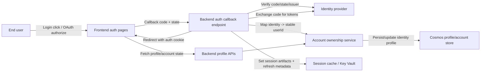
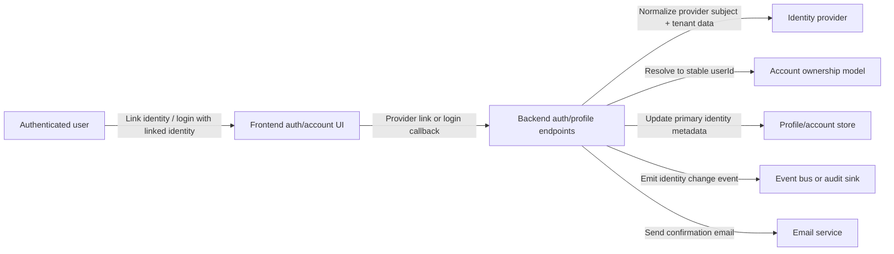
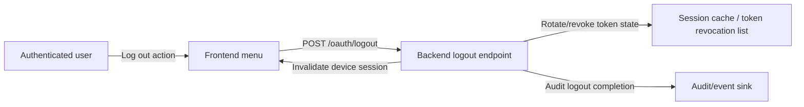

# Threat model and data-flow model for profile/account surfaces

## Scope

This document provides threat-driven flow diagrams and abuse-case coverage for profile/account flows across web and backend boundaries to support Feature `#169` and Story `#177`.

## Data flow model

### 1) Login and OAuth callback flow



**Primary trust boundaries**
- Browser ↔ frontend: untrusted input path.
- Backend ↔ identity provider: high-risk identity trust boundary requiring strict validation.
- Backend ↔ data store/cache: state authority; compromise here impacts user accounts.

### 2) Profile read/write and avatar upload flow

```mermaid
flowchart LR
  U[Authenticated user] -->|Open profile page| FE[Frontend profile UI]
  FE -->|GET /profile| API[Backend profile API]
  API -->|Authorization + schema check| ACCT[Profile/account domain + identity checks]
  ACCT -->|Load data| COS[Profile/account store]
  FE -->|PATCH profile payload| API
  API -->|Validate via shared schema| SCHEMA[@plasius/schema]
  API -->|Write changes / emit events| COS
  API -->|Trigger audit + notifications| AUD[Audit/logging]
  API -->|Signed URL / blob refs| BLOB[Storage]
  API -->|Persist staged avatar| BLOB
```

**Primary trust boundaries**
- Frontend payloads are attacker-controlled and must be validated.
- Storage callbacks are considered untrusted until validated by backend domain services.

### 3) Linked identity and primary-identity switch flow



### 4) Logout and session invalidation flow



## Abuse-case threat model

The table below maps abuse scenarios to required controls and story-level verification points.

| Threat actor | Abuse case | Attack path | Impact | Detection / prevention | Evidence target |
| --- | --- | --- | --- | --- | --- |
| External attacker | Callback replay | Reuse stale OAuth authorization code/state payload | Account session hijack | Short-lived state + nonce/state validation and signature checks, callback uniqueness tests | Task `#203` + backend callback tests |
| External attacker | Privilege escalation via identity switching | Exploit linked identity migration to gain ownership of another account | Unauthorized profile/action access | Strict ownership invariants, audit logs, transactional primary-switch guards | Task `#203` |
| Malicious authenticated user | Mass profile writes | Automated mutation to poison profile and create load | Integrity and availability degradation | Rate limits, idempotency keys, bounded retries, validation gates | Task `#183`/`#184` |
| Malicious authenticated user | Sensitive data leakage | Inject/trigger logs that include tokens or identifiers | Information disclosure | Output encoding, redaction pipelines, masked logs, logging tests | Task `#221`/`#225` |
| External bot/net attacker | Session fixation | Reuse or force session identifiers | Unauthorized privilege and state confusion | Regenerated session identifiers and strict cookie attributes | Story `#177` acceptance + task `#201` |
| Internal misconfig | Open redirect or bad callback URL handling | Inject malicious redirect in auth callback flow | Credential capture / phishing loop | Allowlist redirect targets, strict URI validation | Feature `#169` tests |

## Critical assets

- Stable account ownership key (`userId`)
- Session and refresh token material
- Profile and identity-link metadata
- Linked-identity audit trail
- Consent and security event history

## Trust assumptions

- Identity providers are authoritative for OAuth assertions.
- Backend services enforce authorization on every mutable endpoint.
- Audit storage is append-only for write operations.

## NFR linkage

- Supports `NFR-Security` objectives in Story `#177`.
- Provides verification hooks mapped to Tasks `201`/`202`/`203`/`204`/`205`.
- Informs Task `#225` by defining sensitive logging redaction test scenarios.

## Update history

- `2026-05-21`: Initial diagrams and abuse-case model added for Epic 168 profile/account NFR hardening.
